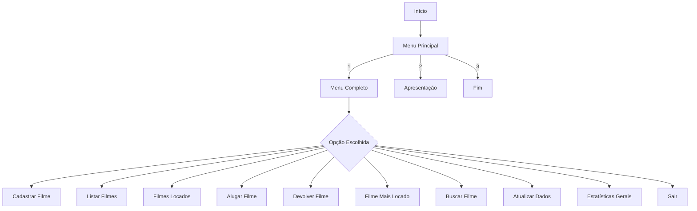

# 🎬 Sistema de Videolocadora — Documentação Oficial

## 📌 Visão Geral

Este projeto implementa um sistema completo de gerenciamento para uma videolocadora, permitindo cadastro, consulta, atualização e controle de locações de filmes. O programa foi desenvolvido em **Portugol Studio**, utilizando modularização (funções), vetores e menus interativos.

---

# 📁 Sumário

* [Sobre o Projeto](#sobre-o-projeto)
* [Funcionalidades](#funcionalidades)
* [Tecnologias](#tecnologias)
* [Estrutura do Código](#estrutura-do-código)
* [Fluxo do Programa](#fluxo-do-programa)
* [Detalhamento das Funções](#detalhamento-das-funções)
* [Estatísticas do Sistema](#estatísticas-do-sistema)
* [Equipe de Desenvolvimento](#equipe-de-desenvolvimento)
* [Licença](#licença)

---

# 🎥 Sobre o Projeto

Este software simula o funcionamento de uma **videolocadora do ano 2000**, quando filmes físicos eram alugados e devolvidos presencialmente. O sistema gerencia:

* catálogo de filmes
* status (locado / disponível)
* número de vezes locado
* busca e atualização
* estatísticas gerais

O limite máximo é de **10 filmes**, conforme o enunciado.

---

# 🧩 Funcionalidades

### ✔ 1. Cadastrar Filme

Armazena:

* nome
* ano de lançamento
* estado de locação
* total de vezes locado

### ✔ 2. Listar Filmes

Exibe:

* filmes disponíveis
* filmes locados
* detalhes completos

### ✔ 3. Filmes Locados

Mostra somente filmes cujo status é *locado*.

### ✔ 4. Alugar Filme

Exibe filmes disponíveis e permite escolher qual alugar.

### ✔ 5. Devolver Filme

Mostra filmes locados e permite marcá-los como disponíveis.

### ✔ 6. Filme Mais Locado

Exibe **todos os dados** do filme mais alugado.

### ✔ 7. Buscar Filme pelo Nome

Mostra todos os dados do filme ou avisa caso não exista.

### ✔ 8. Atualizar Dados

Permite alterar:

* nome
* ano
* número de locações
* status

### ✔ 9. Estatísticas Gerais

Exibe:

* total de filmes cadastrados
* total de filmes locados
* percentual de ocupação da locadora

### ✔ 10. Sair

Encerra a execução.

---

# 🛠 Tecnologias

* **Portugol Studio**
* Paradigma **estruturado**
* Uso de vetores fixos (tamanho 10)
* Modularização por funções

---

# 📚 Estrutura do Código

```
programa
├── vetores de dados
├── funções principais
│   ├── cadastrarFilme
│   ├── listarFilmes
│   ├── filmesLocados
│   ├── alugarFilme
│   ├── devolverFilme
│   ├── filmeMaisLocado
│   ├── buscarFilme
│   ├── atualizarDadosDoFilme
│   ├── estatisticasGerais
│   ├── apresentar
│   ├── menu
│   ├── menuPrincipal
└── inicio()
```

---

# 🔄 Fluxo do Programa



---

# 📘 Detalhamento das Funções

## 1. cadastrarFilme()

* Verifica limite
* Impede nomes duplicados
* Armazena dados iniciais do filme

## 2. listarFilmes()

* Exibe dados completos
* Ignora índices vazios

## 3. filmesLocados()

* Lista somente filmes marcados como TRUE

## 4. alugarFilme()

* Exibe disponíveis
* Valida opção
* Incrementa contador de locações

## 5. devolverFilme()

* Permite escolher filme locado
* Atualiza status

## 6. filmeMaisLocado()

* Procura maior número de locações
* Exibe todos os dados do filme

## 7. buscarFilme()

* Busca por nome
* Exibe dados ou mensagem negativa

## 8. atualizarDadosDoFilme()

* Menu interno com opções de atualização

## 9. estatisticasGerais()

* Mostra:

  * total cadastrados
  * total locados
  * % de ocupação (locados / cadastrados * 100)

---

# 📊 Estatísticas do Sistema

O sistema calcula automaticamente:

* Quantidade total de filmes
* Quantidade de filmes locados
* Taxa de ocupação

Exemplo:

```
Total cadastrados: 8
Total locados: 5
Ocupação: 62.5%
```

---

# 👨‍💻 Equipe de Desenvolvimento

Projeto criado pela equipe:

* **Vinicius** — Lógica e arquitetura do sistema
* **Kaik** — Estrutura de dados e testes
* **Douglas** — Documentação e refinamento

Empresa fictícia: **TocaToonCreators**

---

# 📄 Licença

Este projeto é de uso acadêmico e demonstração.
